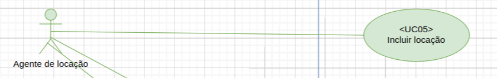
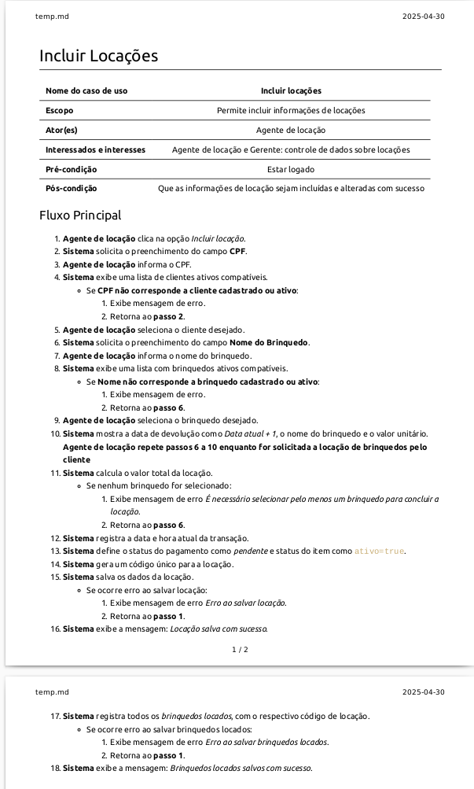

# Casos de testes do Caso de Uso Incluir Locação de Brinquedos

## Caso de uso: Incluir Locação de Brinquedos

A tabela a seguir contém o fluxo básico e alguns fluxos alternativos para o caso de uso Incluir Locação do diagrama acima:

Pré-condição: Agente de locação estar autenticado no sistema.

## Cenários de Teste

| **Cenário** | **Descrição**                                      | **Fluxo 1**               | **Fluxo 2**                     |
|-------------|----------------------------------------------------|---------------------------|----------------------------------|
| **1**       | Inclusão de uma locação com sucesso                | Fluxo principal           | -                                |
| **2**       | Cliente não encontrado                             | Fluxo alternativo (passo 4)| Retorna ao passo 2              |
| **3**       | Brinquedo não encontrado                           | Fluxo alternativo (passo 8)| Retorna ao passo 6              |
| **4**       | Nenhum brinquedo selecionado                       | Fluxo alternativo (passo 11)| Retorna ao passo 6             |
| **5**       | Erro ao salvar a locação                           | Fluxo alternativo (passo 15)| Retorna ao passo 1             |
| **6**       | Erro ao salvar os brinquedos locados               | Fluxo alternativo (passo 17)| Reverte locação salva          |
| **7**       | Locação com múltiplos brinquedos                   | Fluxo principal           | Repete passos 6 a 10            |
| **8**       | Mensagem com data de devolução, nome e valor unitário | Fluxo principal           | -                                |
| **9**       | Cálculo correto do valor total da locação          | Fluxo principal           | -                                |

## Tabela de decisão de casos de testes

| **ID CT** | **Cenário/Condição**                     | **CPF**           | **Nome do Brinquedo** | **Resultado esperado**                                   |
|-----------|------------------------------------------|-------------------|-----------------------|---------------------------------------------------------|
| **CT01**  | Inclusão de uma locação com sucesso      | Válido e ativo    | Válido e ativo        | Locação salva com sucesso, brinquedos registrados.      |
| **CT02**  | Cliente não encontrado                  | Inválido ou inativo | -                     | Mensagem de erro: *Cliente não encontrado ou inativo*.  |
| **CT03**  | Brinquedo não encontrado                | Válido e ativo    | Inválido ou inativo   | Mensagem de erro: *Brinquedo não encontrado ou inativo*.|
| **CT04**  | Nenhum brinquedo selecionado            | Válido e ativo    | Não informado         | Mensagem de erro: *É necessário selecionar pelo menos um brinquedo*. |
| **CT05**  | Erro ao salvar a locação                | Válido e ativo    | Válido e ativo        | Mensagem de erro: *Erro ao salvar a locação. Tente novamente mais tarde*. |
| **CT06**  | Erro ao salvar os brinquedos locados    | Válido e ativo    | Válido e ativo        | Mensagem de erro: *Erro ao salvar os brinquedos locados. Tente novamente mais tarde*. |
| **CT07**  | Locação com múltiplos brinquedos        | Válido e ativo    | Vários válidos e ativos | Locação salva com sucesso, todos os brinquedos registrados. |
| **CT08**  | Data de devolução incorreta             | Válido e ativo    | Válido e ativo        | Mensagem de erro: *Erro ao calcular a data de devolução. Tente novamente*. |
| **CT09**  | Cálculo correto do valor total da locação | Válido e ativo    | Vários válidos e ativos | Valor total calculado corretamente, locação salva.      |

## Matriz de implementação do caso de teste

| **ID CT** | **Cenário/Condição**                     | **CPF**           | **Nome do Brinquedo**       | **Resultado esperado**                                   |
|-----------|------------------------------------------|-------------------|-----------------------------|---------------------------------------------------------|
| **CT01**  | Inclusão de uma locação com sucesso      | 432.137.300-09    | Cama elástica | Locação salva com sucesso, brinquedos registrados.      |
| **CT02**  | Cliente não encontrado / CPF inválido    | 888.888.888-88    | -                           | Mensagem de erro: *Cliente não encontrado ou inativo* e retorno ao passo 2  |
| **CT02**  | Cliente não encontrado / Cliente inativo   | 949.166.830-72    | -                           | Mensagem de erro: *Cliente não encontrado ou inativo* e retorno ao passo 2  |
| **CT02**  | Cliente não encontrado / Cliente inexistente   | 558.805.460-12    | -                           | Mensagem de erro: *Cliente não encontrado ou inativo* e retorno ao passo 2  |
| **CT03**  | Brinquedo não encontrado  / Não existente              | 432.137.300-09    | Brinquedo Desconhecido         | Mensagem de erro: *Brinquedo não encontrado ou inativo* e retorno ao passo 6 |
| **CT03**  | Brinquedo não encontrado  / Brinquedo inativo              | 432.137.300-09    | Brinquedo Inativado         | Mensagem de erro: *Brinquedo não encontrado ou inativo*  e retorno ao passo 6 |
| **CT04**  | Nenhum brinquedo selecionado            | 432.137.300-09    | Nenhum informado               | Mensagem de erro: *É necessário selecionar pelo menos um brinquedo* e retorno ao passo 6  |
| **CT05**  | Erro ao salvar a locação                | 432.137.300-09    | Cama elástica | Mensagem de erro: *Erro ao salvar a locação. Tente novamente mais tarde*  e retorno ao passo 1  |
| **CT06**  | Erro ao salvar os brinquedos locados    | 432.137.300-09    | Cama elástica | Mensagem de erro: *Erro ao salvar os brinquedos locados. Tente novamente mais tarde*  e retorno ao passo 1  |
| **CT07**  | Locação com múltiplos brinquedos        | 432.137.300-09    | Cama elástica e Pula-pula           | Locação salva com sucesso, todos os brinquedos registrados |
| **CT08**  | Data de devolução incorreta             | 432.137.300-09    | Cama elástica | Erro no cálculo da data de devolução |
| **CT09**  | Cálculo correto do valor total da locação | 432.137.300-09    | Cama elástica e Pula-pula           | Valor total calculado corretamente, locação salva. |
